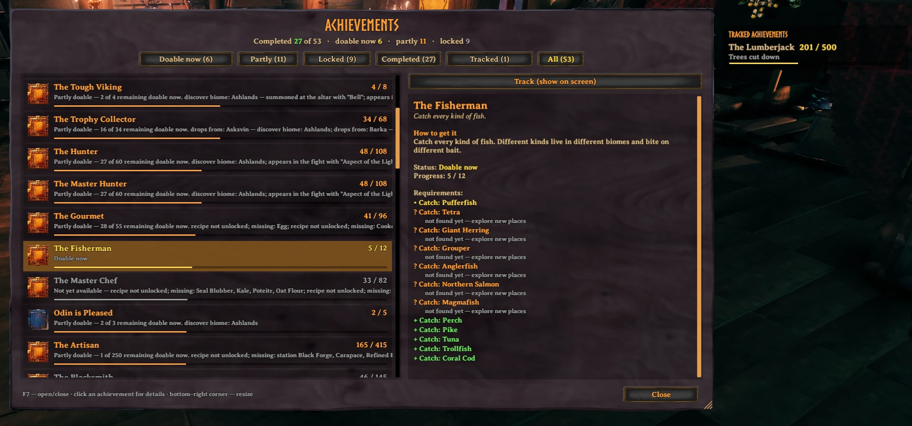
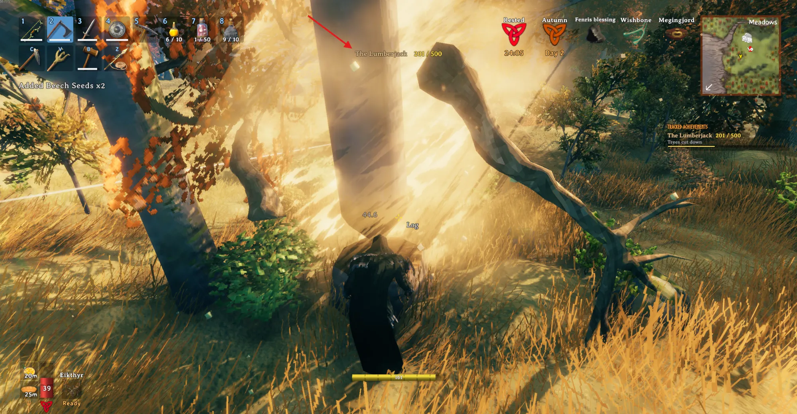
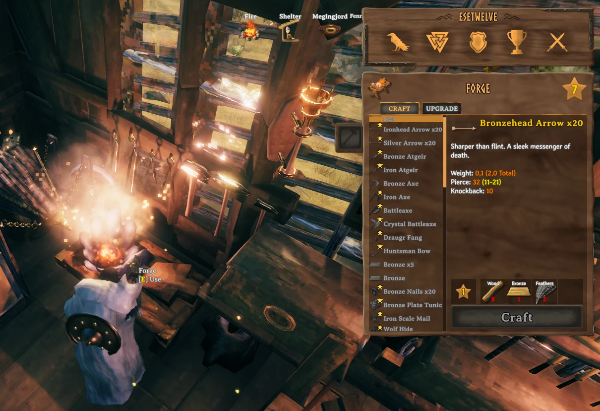

# AchievementTracker for Valheim

Client-side BepInEx/Jötunn mod for Valheim's built-in achievements: an achievement window (F7) that shows what you can complete right now and what is missing, "how to get it" guides, on-screen achievement and skill tracking, progress popups and optional stars on items still needed. English and Russian.

Full description for players: [package/README.md](package/README.md) · Changes: [package/CHANGELOG.md](package/CHANGELOG.md)







## Building

Requirements: .NET SDK, Valheim, a mod manager profile with BepInEx and Jötunn.

```
dotnet build -c Release
```

Paths to the game and to the mod manager profile are set at the top of `AchievementTracker.csproj` (`ValheimDir`, `ModProfile`) and can be overridden, e.g. `dotnet build -c Release -p:ValheimDir="D:\Games\Valheim"`. A Release build runs `DeployProfile.ps1` to copy the DLL and package metadata into the profile's `BepInEx/plugins/Slikfoul-AchievementTracker` and update the existing mod manager entry. Close the manager before building so it reloads the updated profile data on its next launch.

The Thunderstore package is `package/` (manifest, README, CHANGELOG, icon) plus the built `AchievementTracker.dll`, zipped.

## Notes

Made with the help of AI (Claude) and tested in game by the author.

## License

[MIT](LICENSE) © 2026 Slikfoul
